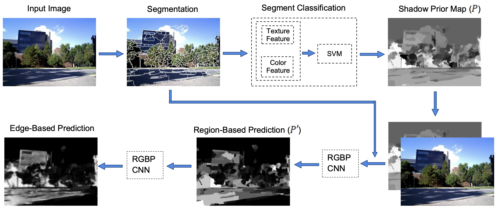

# Fast Shadow Detection from a Single Image Using a Patched CNN

This code is for the paper: S Hosseinzadeh, etc. "Fast Shadow Detection from a Single Image Using a Patched Convolutional Neural Network", Proceedings of the IEEE/IROS 2018, https://arxiv.org/abs/1709.09283



## Generating The Shadow Prior Map Images

* These images are used as image-level prior that are defined in line 44 of main_fast_shadow_detection.py. 
* Install Paired_Region_Prob_Map using README in the folder. Run Paired_Region_Prob_Map/deshadow_driver.m by MATLAB
* Reference paper http://dhoiem.cs.illinois.edu/publications/pami12_shadow.pdf

## Dependencies:
1. nolearn
2. lasagne
3. theano
4. scipy
5. sklearn
6. matplotlib
7. skimage
8. Python’s basic libraries (pickle, sys, os, urllib, gzip, cPickle, h5py, math, time, pdb)

## How To Run The Code:

* python2.7: run main_fast_shadow_detection.py 
* python3: run main_fast_shadow_detection_p3.py

### Notes: 

* Build folders "data_cache" and "prediction_output_v1" for data training/testing output files, and output prediction result files.
* TrainImgeFolder: Training Images
* TrainMaskFolder: Training Masks (Ground Truth)
* TrainFCNFolder: Shadow Prior Map Images
- Likewise for testing images…
- The Mask and Shadow Prior files should have 1 dimension, and Mask files also should be binary.

### Using GPU:
```
Content in ~/.theanorc:

[global]

floatX = float32

[nvcc]

fastmath = True
```
